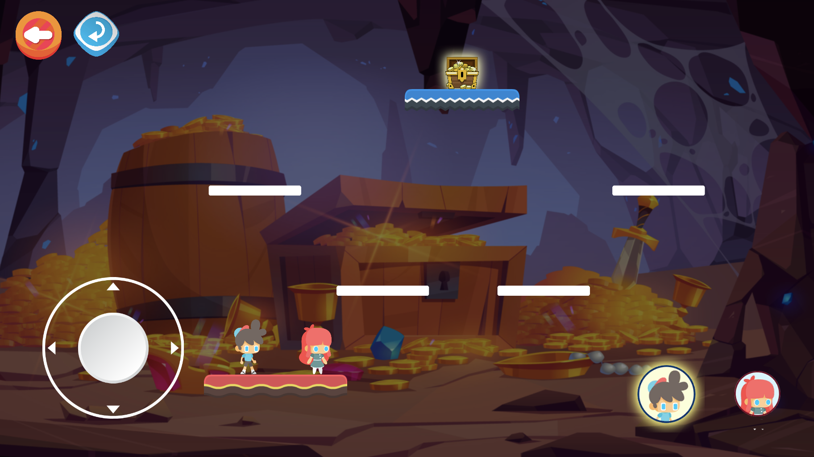
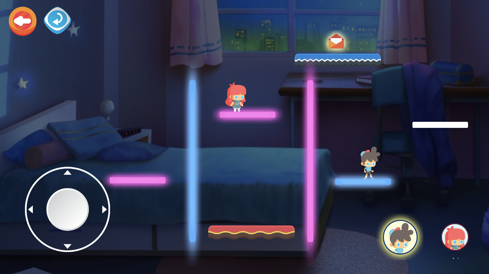
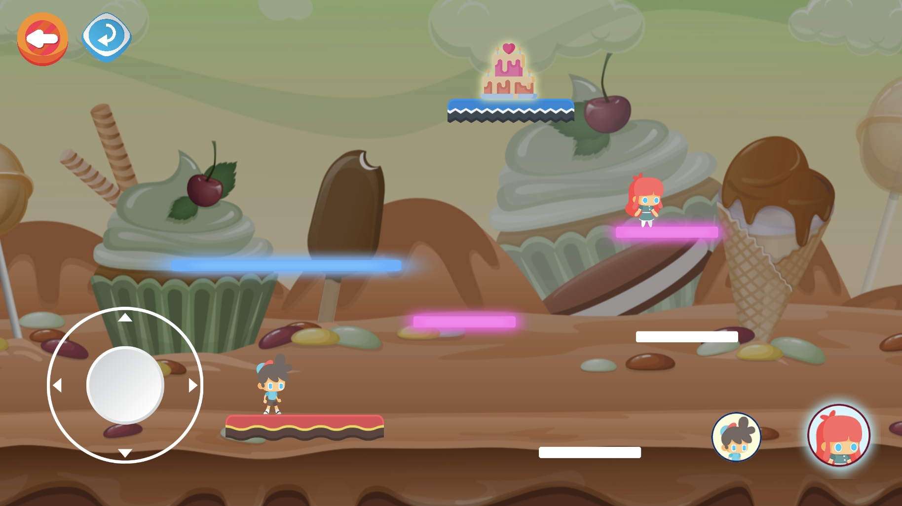

# Love Puzzle
Author: *Minh Anh Nguyen*  
A beautiful Unity game for android.  

The rules  
1. If the boy steps on the white ground, it will turns into blue. If the girl steps on it, it will turns into pink.  
2. The boy cannot step on the pink grounds, he will go through them if try to do so. Likewise, The girl cannot step on the blue ones.  
3. They have to find the way to reach to reach to the target. When both of them are stepping on the target, the level is completed.

## Installation
Download file **love_puzzle.apk** in the **release** directory and install the game on your android.  

## Game interface
Game Menu  

Level 1  

Level 2  

Level 3  

